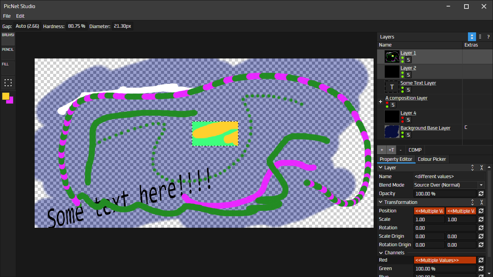

## PicNet Studio
A simple layer-based photo editor, currently very WIP, using Avalonia as the front end

Some ideas I have for the future:
- Plugin support, custom brushes
- Customisable UI, something similar to PixiEditor or C4D
- Multiple editor windows open per instance, tabs movable between windows

The canvas can be exported by pressing CTRL+E

## Preview so far

## Current features
Here's a list of features and some info about what they do and how to use them

### ToolBar
The toolbar on the left side shows all the available tools you can use. The current list of tools are:
- Circular brush tool (supports diameter, hardness and gap) (shortcut: B)
- Square Pencil tool (supports width and gap) (shortcut: P)
- Flood fill (shortcut: F)
- Selection tool, to limit drawing area (shortcut: S, can be cleared with CTRL+D)

The primary and secondary colours can be changed by clicking either of the 2 buttons on the middle left toolbar.
All tools so far and most in the future support using both by using left or right clicking respectively

### ToolBar Settings panel
This is strip on the top that shows properties about the active tool 

### Layer Tree
The layer tree on the top right presents all the layers. Layers can be grouped by selecting 
some and clicking CTRL+G (or by clicking COMP, as in Composition Layer).

Most layers have 3 state adjustment buttons. The 2 green buttons change visibility for view port aka
preview (top) and export (bottom). The S button toggles Solo mode, which makes a specific layer the only one to be drawn

### Property Editor
The property editor on the bottom right lets you change properties on the layer and, soon, the canvas
and document. This is a custom property editor I made to support multiple selections. It presents all 
properties that are available across your selection (e.g. all visual layers have Opacity in common).

When there's multiple selections which have differing values, the orange "<<Multiple Values>" shows. ATM i'm not sure
whether to re-implement an addition feature (e.g. add/subtract from the values) or to just set them all to the same value
when you modify them. A todo thing

## Contributing
Feel free to contribute whatever you want if you think it'll make the editor better!

## Licence
All source files in PicNetStudio are under the GNU General Public License version 3.0 or later (GPL v3.0+). 
PicNetStudio uses libraries that have other licences, such as MIT licences.

If any source file is missing a copyright notice, it is assumed to be licenced under the same licence as PicNetStudio
