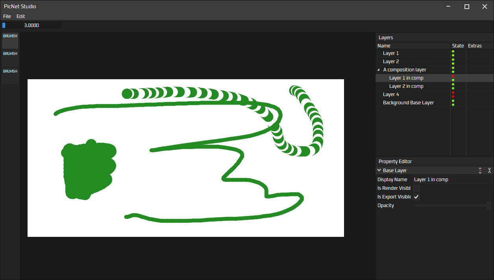

## PicNet Studio
A simple layer-based photo editor, currently very WIP, using Avalonia as the front end

Some ideas I have for the future:
- Plugin support, custom brushes
- Customisable UI, something similar to PixiEditor or C4D
- Multiple editor windows open per instance, tabs movable between windows

## Preview so far

## Contributing
Feel free to contribute whatever you want if you think it'll make the editor better!

## Licence
All source files in PicNetStudio are under the GNU General Public License version 3.0 or later (GPL v3.0+). 
PicNetStudio uses libraries that have other licences, such as MIT licences.

If any source file is missing a copyright notice, it is assumed to be licenced under the same licence as PicNetStudio