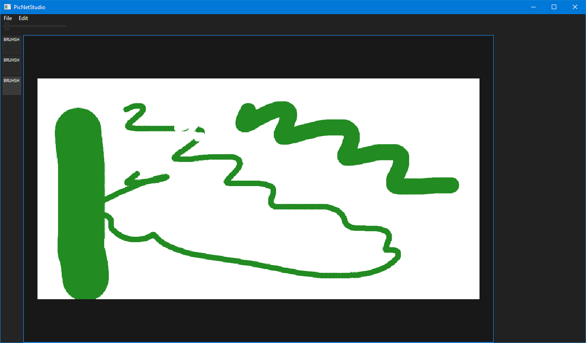

## PicNet Studio
A simple layer-based photo editor, currently very WIP, using Avalonia as the front end

Some ideas I have for the future:
- Plugin support, custom brushes
- Customisable UI, something similar to PixiEditor or C4D
- Multiple editor windows open per instance, tabs movable between windows

## Preview so far

## Core code
I created a Bitmap class called PNBitmap which contains skia bitmap and canvas references and a raw pointer to the pixel data. Rasterised layers used this to store pixels and, at the moment, this is the only supported layer type.

- User clicks their mouse to draw, that reaches BrushTool.cs which draws into the active layer's bitmap
- Document's canvas render invalidation event is fired, which reaches CanvasControl.cs which then schedules a render at high priority
- CanvasControl::InvalidateRender(), it initialises rendering using a combination of WriteableBitmap and SKSurface (in SKAsyncViewPort)
- Each layer is drawn into that surface (async optimisations possible maybe?)
- InvalidateVisual() and the WriteableBitmap is drawn onscreen
